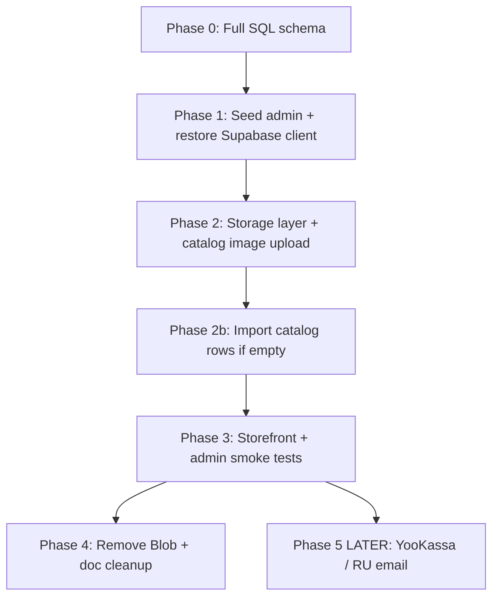

# Russia migration plan — schema done, wire runtime next

## Current status (Jun 2026)

| Step | Status |
|------|--------|
| Russia Supabase project + `POSTGRES_URL` | Assumed done |
| Full schema on empty DB | **Done** — `npm run db:bootstrap:apply` (7 files in `db/bootstrap/`) |
| Admin seed user | **Not done** — `scripts/seed-admin.ts` |
| `getSupabaseAdmin()` wired | **Not done** — returns `null` → admin login + most admin APIs broken |
| Catalog storage layer | **Not done** — `lib/catalog/storage.ts` still targets VPS disk (`CATALOG_STORAGE_DIR`) |
| Catalog rows + images in DB | **Unknown** — run import if catalog is empty |
| Vercel production deploy with correct env | **Verify** |

**What works today without more code:** storefront catalog **reads** via `lib/db/client.ts` + `POSTGRES_URL` (no Supabase JS client needed for reads).

**What is broken until Phase 1:** `/admin` login, admin mutations, admin image uploads, anything calling `getSupabaseAdmin()`.

---

## Core principle

**MVP does not mean fewer admin features.** Same UI, tables, and stored data as Thailand — different providers where needed:

| Capability | Thailand | Russia (target) | Russia (now) |
|------------|----------|-------------------|--------------|
| Hosting | Vercel | Vercel | Vercel |
| Database | Supabase Postgres | Supabase Postgres | Supabase Postgres |
| File storage | Supabase Storage | Supabase Storage | **Blob / VPS paths in code** — migrate next |
| Payments | Stripe | Disabled in UI | Disabled |
| Analytics | GTM / GA4 | Yandex Metrica | Yandex Metrica |
| Email | Resend | Deferred | Deferred |

Provider-specific changes (YooKassa, RU email) stay in **Phase 5** — after schema + UI parity.

---

## Two migration folders (same Postgres)

| Folder | Purpose |
|--------|---------|
| [`db/bootstrap/`](db/bootstrap/) | **7 curated files** — final schema for **fresh empty** DBs (`npm run db:bootstrap:apply`) |
| [`supabase/migrations/`](supabase/migrations/) | **68 incremental files** — Thailand history; keep for live DBs; add **new** changes here |

Russia fresh install = **`db/bootstrap/`** (not manually running 68 files). See [`docs/DATABASE_BOOTSTRAP.md`](docs/DATABASE_BOOTSTRAP.md).

`db/migrations/001_catalog_schema.sql` is **deprecated** — do not use as prod source of truth.

---

## Permanent stack

| Layer | Technology | Never use |
|-------|------------|-----------|
| App hosting | **Vercel** | VPS for MVP |
| Database | **Supabase Postgres** (`POSTGRES_URL`) | Thailand Supabase project ref |
| All files | **Supabase Storage** | Vercel Blob (remove in Phase 4), VPS disk |

---

## Migration phases



---

## Phase 0 — Full schema bootstrap ✅ DONE

Applied via:

```bash
export POSTGRES_URL="postgres://..."
npm run db:bootstrap:apply
```

Files (in order): `01_orders_checkout.sql` … `07_security_hardening.sql`.

### Optional: verification script (still to build)

**`scripts/verify-russia-schema.ts`** — checks required tables + `storage.buckets` (`catalog`, receipt/proof buckets). Run after bootstrap before deploying app code.

> Note: `scripts/apply-db-bootstrap.ts` replaces the old plan's `apply-supabase-migrations.ts` for fresh DBs. Incremental changes still go in `supabase/migrations/`.

### Required tables (must exist after Phase 0)

| Domain | Tables |
|--------|--------|
| **Auth** | `admin_users`, `audit_logs` |
| **Catalog** | `catalog_partners`, `catalog_bouquets`, `catalog_products`, `catalog_site_settings`, `catalog_slug_registry`, `catalog_product_images`, `catalog_product_revisions`, `catalog_collections`, `catalog_collection_items`, `catalog_audit_events` |
| **Partners** | `partner_applications` |
| **Orders** | `orders`, `order_items`, `order_status_history`, `checkout_drafts`, `supplier_order_requests`, `supplier_order_request_events` |
| **Accounting** | `expenses`, `expense_receipt_images`, `income_records`, `income_refunds`, `accounting_transfers`, `accounting_withdrawals` |
| **Email** | `email_templates`, `email_outbox`, `customer_reminders`, `reminder_email_logs` |
| **Reviews** | `customer_reviews` |
| **Newsletter** | `newsletter_subscribers`, `welcome_codes` |
| **Legacy parity** | `stripe_events` (empty in RU — schema only) |
| **Storage** | buckets: `catalog` (public), `receipts`, `proofs` |

---

## Phase 1 — Runtime (DO THIS NEXT)

### 1a. Vercel environment variables

Set on Vercel project (Production + Preview):

| Variable | Purpose |
|----------|---------|
| `POSTGRES_URL` | Supabase pooler — storefront reads, bootstrap apply |
| `SUPABASE_URL` | `https://[ref].supabase.co` — admin client + Storage API |
| `SUPABASE_SERVICE_ROLE_KEY` | Admin bypass RLS — **server only** |
| `AUTH_SECRET` | NextAuth for `/admin` |
| `NEXT_PUBLIC_APP_URL` | `https://www.ekb-flowers.ru` |

Thailand ref `kwbffyojrdjlehdhpptf` is blocked by `lib/env/validateRussiaEnv.ts`. Russia `SUPABASE_URL` is **allowed**.

Redeploy after env changes.

### 1b. Seed admin user

```bash
export SUPABASE_URL="https://[ru-ref].supabase.co"
export SUPABASE_SERVICE_ROLE_KEY="..."
export ADMIN_SEED_EMAIL=k.v.polovnikov@gmail.com
export ADMIN_SEED_PASSWORD="..."
npm run seed-admin
```

### 1c. Restore Supabase client

[`lib/supabase/server.ts`](lib/supabase/server.ts) currently returns `null` — blocks [`auth.ts`](auth.ts) and all `lib/supabase/*` admin queries.

- Wire real client from `SUPABASE_URL` + `SUPABASE_SERVICE_ROLE_KEY`
- Reject Thailand project ref `kwbffyojrdjlehdhpptf`

### 1d. Fix storage layer

[`lib/catalog/storage.ts`](lib/catalog/storage.ts):

- Upload → `supabase.storage.from('catalog').upload(...)`
- Public URL → `{SUPABASE_URL}/storage/v1/object/public/catalog/{path}`
- Remove VPS disk (`CATALOG_STORAGE_DIR`) paths

### 1e. Next.js images

Add `*.supabase.co` to [`next.config.js`](next.config.js) `remotePatterns` (or use `CATALOG_CDN_URL`).

---

## Phase 2 — Catalog data + images

### 2a. Upload local mirror to Supabase Storage

**`scripts/migrate-catalog-images-to-supabase.ts`** (to build or adapt from `mirror-catalog-to-vps.ts`):

- Source: `data/catalog/` (+ manifest if present)
- Upload to `catalog` bucket (created in bootstrap `06_catalog.sql`)
- Rewrite `public_url` in Postgres jsonb columns

### 2b. Re-import catalog rows (if DB has no bouquets)

```bash
npm run import-catalog-pg:dry-run
npm run import-catalog-pg
```

Run **after** image URLs point at Supabase Storage, not Blob or `/catalog/` VPS paths.

---

## Phase 3 — Success criteria

### Storefront (public site live)

- [ ] `https://www.ekb-flowers.ru` loads
- [ ] `/ru/catalog` lists products (or empty state if no import yet)
- [ ] Product page images load from `*.supabase.co/storage/...`
- [ ] `/ru/partner/apply` form submits to Postgres
- [ ] No requests to Thailand `kwbffyojrdjlehdhpptf` in Network tab

### Admin UI parity

Open each route — page must **render** (tables, forms, nav). Empty data OK; 500/error not OK.

**Overview & orders:** `/admin/overview`, `/admin/orders`, `/admin/orders/[order_id]`, supplier-requests

**Products:** `/admin/products`, new, bouquet/product edit, moderation, review, hero

**Partners:** `/admin/partners/applications`

**Accounting:** overview, ledger, income, expenses, payouts, withdrawals

**Other:** `/admin/expenses`, `/admin/emails`, `/admin/reviews`, `/admin/settings/collections`

### API smoke tests

- [ ] `GET /api/admin/verify-supabase` → configured
- [ ] Admin login → session works
- [ ] Product image upload → file visible in Storage bucket

---

## Phase 4 — Remove Blob + doc cleanup

Only after Phase 3 passes:

- Remove `@vercel/blob`, [`lib/orders/blobStore.ts`](lib/orders/blobStore.ts), Blob env vars
- Migrate [`lib/customOrder/uploadReferenceImage.ts`](lib/customOrder/uploadReferenceImage.ts) → Supabase Storage
- Update [`ai_context/`](ai_context/), [`README.md`](README.md), [`.env.example`](.env.example)
- Remove Neon / VPS / Blob references

---

## Phase 5 — DEFERRED: Russia provider tweaks

| Change | When |
|--------|------|
| YooKassa payment integration | After admin parity |
| Rename `stripe_*` columns | Optional |
| Email provider (RU SMTP) | After admin parity |
| GA4 columns | Leave unused or drop later |
| Storefront locale/copy | Content pass |

---

## Immediate next steps (ordered)

1. **Confirm schema** — optional `verify-russia-schema.ts` or quick SQL: `\dt` in Supabase SQL editor
2. **Set Vercel env** — `POSTGRES_URL`, `SUPABASE_URL`, `SUPABASE_SERVICE_ROLE_KEY`, `AUTH_SECRET`
3. **`restore-supabase-client`** — code change in `lib/supabase/server.ts`
4. **`npm run seed-admin`** — create admin login
5. **`fix-storage-layer`** + migrate images + import catalog if needed
6. **Redeploy Vercel** — smoke test storefront + `/admin`

---

## Root cause summary

| Problem | Fix phase |
|---------|-----------|
| Schema missing | Phase 0 ✅ |
| `getSupabaseAdmin()` returns null | Phase 1c |
| Admin login fails | Phase 1b + 1c |
| Missing catalog data | Phase 2b |
| Stale Blob / `/catalog/` URLs in DB | Phase 2a |
| Storage uploads target VPS disk | Phase 1d |

---

## Explicitly out of scope

- Self-hosted VPS / Timeweb (not planned)
- Stripping admin features for "minimal MVP"
- Thailand Supabase dual-write
