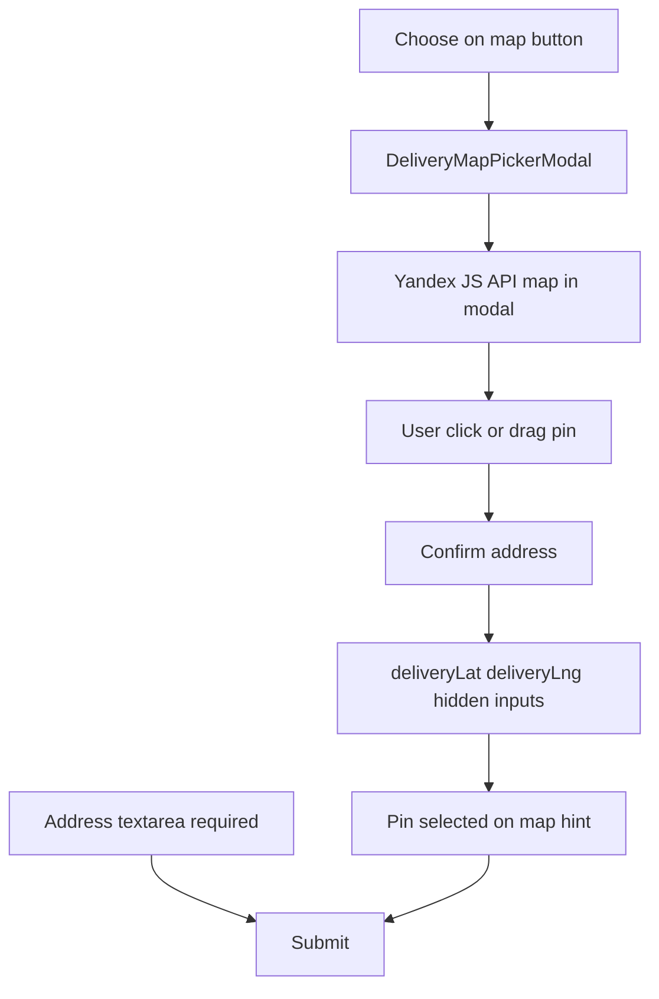

# Yandex in-site map picker — implementation plan

## Requirements (confirmed)

- **No redirect** — customer stays on ekb-flowers.ru
- **Button** near address field: “Выбрать на карте” / “Choose on map”
- **Modal overlay** — responsive, mobile-friendly
- **Yandex JavaScript API 3.0 only** (free tier; API key required — not a paid license for public sites)
- **No Geosuggest, no Geocoder** in MVP
- **Click** map to place pin; **drag** pin to adjust
- **Confirm** → save `deliveryLat`, `deliveryLng` (+ auto-build Yandex share URL in `deliveryGoogleMapsUrl`)
- **Hidden fields** for lat/lng in checkout DOM
- **Hint** under address: “Точка выбрана на карте” when pin set
- **Manual address textarea** remains required (unchanged validation)
- **Code structure** for future reverse geocoding behind `NEXT_PUBLIC_YANDEX_REVERSE_GEOCODE=true`
- **Do not break** existing checkout visual design (`co-input`, `co-field`, accent tokens)

## Architecture



## Files to create

| File | Purpose |
|------|---------|
| [`lib/yandex/ekbMapDefaults.ts`](lib/yandex/ekbMapDefaults.ts) | Center `[60.6057, 56.8389]`, zoom 12/15 |
| [`lib/yandex/buildYandexMapsUrl.ts`](lib/yandex/buildYandexMapsUrl.ts) | `buildYandexMapsPointUrl(lng, lat)` |
| [`lib/yandex/loadYmaps3.ts`](lib/yandex/loadYmaps3.ts) | One-time script load + `ymaps3.ready` |
| [`lib/yandex/features.ts`](lib/yandex/features.ts) | `YANDEX_REVERSE_GEOCODE_ENABLED` flag |
| [`lib/yandex/reverseGeocode.ts`](lib/yandex/reverseGeocode.ts) | Stub; no-op until flag enabled |
| [`lib/yandexMapsUrl.ts`](lib/yandexMapsUrl.ts) | `isValidYandexMapsUrl`, `isValidDeliveryMapsUrl` |
| [`components/checkout/DeliveryMapPickerModal.tsx`](components/checkout/DeliveryMapPickerModal.tsx) | Modal + imperative map init |

## Files to edit

| File | Change |
|------|--------|
| [`components/checkout/DeliveryAddressFields.tsx`](components/checkout/DeliveryAddressFields.tsx) | Remove Google paste row; add button, modal, hidden inputs, pin hint |
| [`components/checkout/premium/PremiumCheckoutFlow.tsx`](components/checkout/premium/PremiumCheckoutFlow.tsx) | Pass new i18n labels |
| [`lib/checkout/premiumCheckoutValidation.ts`](lib/checkout/premiumCheckoutValidation.ts) | `isValidDeliveryMapsUrl` instead of Google-only |
| [`lib/i18n.ts`](lib/i18n.ts) | `chooseOnMap`, `confirmMapAddress`, `pinSelectedOnMap`, modal strings |
| [`.env.example`](.env.example) | `NEXT_PUBLIC_YANDEX_MAPS_API_KEY=` |

## DeliveryMapPickerModal — technical notes

- `'use client'`; open only when `isOpen` (lazy-load script on first open)
- Overlay: fixed inset, backdrop click + Escape closes (pattern from [`DeliveryRouteMapModal`](app/admin/components/DeliveryRouteMapModal.tsx))
- Mobile: full-width panel, `max-height: 100dvh`, safe-area padding, map `height: 280px` (mobile) / `360px` (≥768px)
- Map init in `useEffect` after `loadYmaps3()`:
  - `YMap` + `YMapDefaultSchemeLayer` + `YMapDefaultFeaturesLayer`
  - `YMapMarker` with `draggable: true`, custom pin element (accent circle)
  - `YMapListener` `onClick` → move marker (ignore clicks on marker itself)
  - `onDragEnd` on marker → update draft coords
- Draft coords in React state; **Confirm disabled** until pin placed
- On confirm: `onConfirm({ lat, lng })` → parent sets fields + `buildYandexMapsPointUrl`
- Optional call `reverseGeocodeDeliveryPin` on confirm (no-op in MVP)
- Cleanup: remove listener/marker/map on close

## DeliveryAddressFields changes

Below address textarea:

```tsx
<button type="button" className="co-map-picker-btn">Choose on map</button>
<input type="hidden" name="deliveryLat" value={lat ?? ''} />
<input type="hidden" name="deliveryLng" value={lng ?? ''} />
{hasPin && <p className="co-pin-selected-hint">Pin selected on map</p>}
```

- **Do not clear** `deliveryLat`/`deliveryLng` when user edits address text (pin independent of typed address)
- Button disabled with hint if API key missing
- Styles: match `co-input` border-radius 14px, `min-height: 48px`, full-width on mobile

## i18n keys (buyNow + checkout)

| Key | ru | en |
|-----|----|----|
| `chooseOnMap` | Выбрать на карте | Choose on map |
| `mapPickerTitle` | Точка доставки | Delivery spot |
| `mapPickerHint` | Нажмите на карту или перетащите метку | Tap the map or drag the pin |
| `confirmMapAddress` | Подтвердить адрес | Confirm address |
| `pinSelectedOnMap` | Точка выбрана на карте | Pin selected on map |
| `mapPickerClose` | Закрыть | Close |
| `mapPickerLoading` | Загрузка карты… | Loading map… |

## Env

```bash
# Yandex Maps JS API — free public-site tier; restrict HTTP Referer to ekb-flowers.ru + localhost
NEXT_PUBLIC_YANDEX_MAPS_API_KEY=

# Future reverse geocoding (off in MVP)
# NEXT_PUBLIC_YANDEX_REVERSE_GEOCODE=true
```

Register key at [developer.tech.yandex.ru](https://developer.tech.yandex.ru) → JavaScript API only (no Geosuggest/Geocoder packages for MVP).

## Validation

- Address: still `hasDeliveryAddressInput` (≥10 chars) — **unchanged**
- Maps URL: if present, accept Yandex URLs via `isValidDeliveryMapsUrl`
- Pin: **optional** for checkout submit (recommended for couriers; not blocking MVP unless product decides otherwise)

## Mobile checklist

- 48px button; 16px inputs in modal
- `touch-action: none` on map container only
- Modal scrollable if keyboard open; confirm button sticky at bottom of modal on small screens
- Works without popup blockers (everything in-site)

## Out of scope

- Geosuggest autocomplete
- Geocoder / auto-fill address from pin
- Removing Google references in admin emails (separate pass)
- Google contact page embed

## Blocker

**Plan mode is active** — code edits are blocked. Switch to **Agent mode** and say “execute the plan” to implement.
